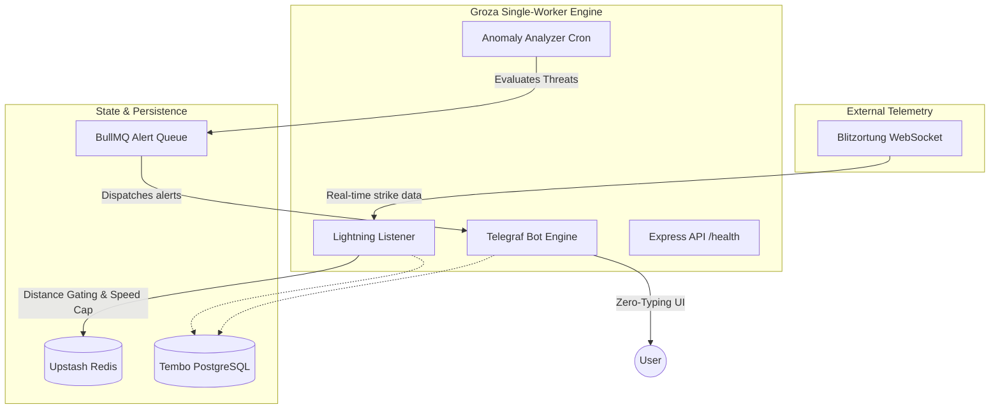

  <picture>
    <source media="(prefers-color-scheme: dark)" srcset="https://raw.githubusercontent.com/github/explore/80688e429a7d4ef2fca1e82350fe8e3517d3494d/topics/nodejs/nodejs.png">
    
  </picture>
  
  # Groza Telemetry Bot
  
  **Real-time lightning telemetry, anomaly filtering, and zero-typing alerts.**

  [🇷🇺 Читать на русском](README.ru.md)
  
  
  
  

   

  **[🚀 Try the Bot in Telegram](https://t.me/groza_alert_bot)**

---

## ⚡ What is Groza?

Generic weather apps provide slow, region-wide probabilistic forecasts. Groza solves the "noise" problem by connecting directly to the **Blitzortung real-time lightning telemetry network**. 

It provides instant, geo-fenced threat alerts, protecting outdoor operations, events, and personal safety without spamming users.

> [!TIP]
> **Business Value:** Groza replaces reactive weather checking with proactive, precise distance-gated alerts. If lightning strikes within 15km, you know instantly. 

---

## 🏗️ System Architecture & Data Flow

<b>View Architecture Diagram</b>

---

## 🛠️ Engineering Challenges Overcome

> [!IMPORTANT]
> **Distance Gating & Speed Cap Filter**  
> Raw lightning telemetry can be extremely noisy. To prevent alert fatigue and false positives, Groza uses `@turf/turf` for real-time spatial analysis. It applies a **Distance Gating** algorithm (ignoring strikes > 15km for extreme threats) and a **Speed Cap** (up to 90 km/h anomaly filtering), ensuring users only receive actionable intelligence.

- **Zero-Typing UI:** The bot operates entirely via a persistent keyboard menu. Users never need to type commands, eliminating parsing errors and significantly reducing time-to-action during emergencies.
- **Resilient WebSocket Telemetry:** The connection to Blitzortung is designed to self-heal. If the socket drops, the engine automatically queues reconnections and gracefully degrades to a "Warning" mode without crashing the Node.js process.
- **Separation of Concerns (UX vs. Metrics):** Client status summaries are strictly separated from admin dashboards (`/admin_metrics`), ensuring end-users see clean, 60-minute scoped data while maintainers have full observability.

---

## 📊 Operational Excellence & Cost Engineering

By unifying the architecture into a **Single-Worker Engine**, Groza minimizes operational overhead:
- **Zero-Downtime Telemetry:** API, Bot, and Listener run concurrently on a single Node process.
- **Lean Footprint:** Replaced heavy geospatial databases with in-memory `turf.js` calculations + Upstash Redis cache.
- **Fail-Safe Startup:** Implemented strict DB/Redis ping checks on boot. If dependencies fail, the system enters a degraded state rather than loop-crashing.

---

## 🔒 Trust & Security

- **Dependency Pinning:** All dependencies in `package.json` are strictly versioned to prevent supply-chain attacks.
- **Environment Isolation:** Secrets (like `DATABASE_URL`, `REDIS_URL`) are loaded securely. Missing critical environment variables instantly halts the boot sequence safely.
- **Security Policy:** See [SECURITY.md](SECURITY.md) for details on our dependency management and reporting guidelines.

---

## 📄 License & Usage

> [!CAUTION]
> **Proprietary & All Rights Reserved**  
> This repository is published strictly for **portfolio showcase and architectural demonstration** purposes.  
> - ❌ You **may not** copy, modify, distribute, or use this code for commercial or personal projects.  
> - ❌ This is **not** an open-source template. No license (such as MIT or GPL) is granted.  
> - ✅ You **may** read the code to evaluate the engineering practices, system design, and coding standards.
