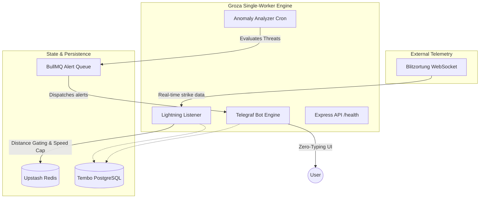

  <picture>
    <source media="(prefers-color-scheme: dark)" srcset="https://raw.githubusercontent.com/github/explore/80688e429a7d4ef2fca1e82350fe8e3517d3494d/topics/nodejs/nodejs.png">
    
  </picture>
  
  # Телеграм-бот Groza
  
  **Телеметрия гроз в реальном времени, фильтрация аномалий и Zero-Typing уведомления.**

  [🇬🇧 Read in English](README.md)
  
  
  
  

   

  **[🚀 Запустить бота в Telegram](https://t.me/groza_alert_bot)**

---

## ⚡ Что такое Groza?

Обычные погодные приложения дают медленные вероятностные прогнозы для целых регионов. Groza решает проблему "информационного шума", подключаясь напрямую к сети **онлайн-телеметрии молний Blitzortung**. 

Бот мгновенно присылает уведомления об угрозах с учётом геозон, защищая людей и объекты на открытом воздухе без спама ложными срабатываниями.

> [!TIP]
> **Бизнес-ценность:** Groza заменяет постоянный мониторинг погоды на проактивные оповещения на базе геометрии. Если молния ударит в радиусе 15 км от вас — вы узнаете об этом мгновенно.

---

## 🏗️ Архитектура и поток данных

<b>Посмотреть схему архитектуры</b>

---

## 🛠️ Инженерные вызовы и решения

> [!IMPORTANT]
> **Алгоритм Distance Gating и Speed Cap**  
> Сырая телеметрия молний крайне зашумлена. Чтобы предотвратить усталость от предупреждений (alert fatigue) и ложные срабатывания, Groza использует `@turf/turf` для пространственного анализа в реальном времени. Применяется **Distance Gating** (игнорирование ударов > 15 км) и **Speed Cap** (фильтрация аномалий до 90 км/ч), что гарантирует пользователям получение только значимых данных.

- **Zero-Typing UI:** Бот управляется исключительно через постоянное меню-клавиатуру. Пользователям не нужно вводить команды текстом, что исключает ошибки синтаксиса и критически ускоряет реакцию в экстренных ситуациях.
- **Отказоустойчивость WebSockets:** Подключение к Blitzortung спроектировано с функцией самовосстановления. При разрыве сокета движок автоматически ставит в очередь переподключение и изящно деградирует в режим "Ожидание", не обрушивая процесс Node.js.
- **Разделение зон ответственности (UX и Метрики):** Пользовательские статусы строго отделены от админ-дашбордов (`/admin_metrics`), гарантируя, что конечный пользователь видит только чистые данные за последние 60 минут, а разработчик имеет полную наблюдаемость системы.

---

## 📊 Операционная эффективность (Cost Engineering)

> [!WARNING]
> **Zero-Cost Инфраструктура**  
> Проект полностью реализован на бесплатных тарифах (Free Tier стек), что сводит стоимость обслуживания к **$0/мес**. Из-за ограничений бесплатных платформ (холодные старты, лимиты запросов, гибернация) иногда могут возникать перебои в работе бота. Если что-то не работает — **[пишите мне в Telegram](https://t.me/YOUR_PERSONAL_USERNAME)**.

Объединение архитектуры в паттерн **Single-Worker Engine** минимизирует операционные расходы:
- **Телеметрия без даунтаймов:** API, бот и Listener работают конкурентно в одном процессе Node.
- **Минимальное потребление ресурсов:** Тяжёлые геопространственные БД заменены на in-memory вычисления `turf.js` в связке с кэшем Upstash Redis.
- **Безопасный старт (Fail-Safe):** Реализованы строгие ping-проверки БД и Redis при загрузке. Если зависимости недоступны, система безопасно переходит в Degraded status, а не уходит в бесконечный цикл падений.

---

## 🔒 Безопасность

- **Фиксация зависимостей:** Все зависимости в `package.json` строго зафиксированы по версиям для защиты от атак на цепочку поставок (supply-chain attacks).
- **Изоляция окружения:** Секреты (`DATABASE_URL`, `REDIS_URL`) загружаются безопасно. Отсутствие критически важных переменных окружения немедленно и безопасно останавливает загрузку.
- **Security Policy:** Подробности управления уязвимостями и политику безопасности смотрите в [SECURITY.md](SECURITY.md).

---

## 📄 Лицензия и использование

> [!CAUTION]
> **Проприетарное ПО (All Rights Reserved)**  
> Данный репозиторий опубликован исключительно **в целях демонстрации архитектуры для портфолио**.  
> - ❌ Вы **не имеете права** копировать, модифицировать, распространять или использовать этот код в коммерческих или личных проектах.  
> - ❌ Это **не** open-source шаблон. Лицензии (такие как MIT или GPL) не предоставляются.  
> - ✅ Вы **можете** изучать исходный код для оценки инженерных практик, архитектуры системы и стандартов написания кода.
